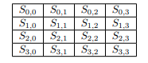
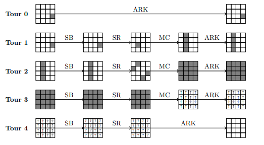

# Attaque "Square" sur AES 4 et 5 tours

## Notions fondamentales

### État

Dans AES, un « état » (state) est la représentation intermédiaire du bloc de données (128 bits) pendant le chiffrement/déchiffrement.
C'est une matrice 4 x 4 d'octets, notée $(s_{i, j})$. On la représentera de la façon suivante :

### Cellule

Pour $i, j \in \{0, 1, 2, 3\}$, la cellule $(i, j)$ est $j$-ième colonne de la $i$-ème ligne d'un état.

### Cellule active

Prenons $(s^{(t)})_t$ un ensemble de 256 états et fixons une cellule $(i, j)$.
Cette cellule est dite active à travers $(s^{(t)})_t$ lorsque
$$ \{ s_{i, j}^{(t)} : t = 0, ..., 255 \} = \{0, ..., 255\},$$
c'est-à-dire lorsque la cellule est traversée par tous les octets à travers les 256 états.

### Cellule inactive

Soit $(s^{(t)})_t$ un ensemble de 256 états et fixons une cellule $(i, j)$.
Cette cellule est dite inactive à travers $(s^{(t)})_t$ si
$$ \{ s_{i, j}^{(t)} : t = 0, ..., 255 \} = \{c\},$$
où $c$ est une valeur d'octet constante.
C'est-à-dire que la cellule doit garder sa valeur constante au travers des 256 états.

### $\Lambda$-set

On dit qu’un ensemble de 256 états $(s^{(t)})_{t=0...255}$ est
un $\Lambda$-set si chacune de ses cellules est soit active, soit inactive.

### Cellule équilibrée

Soit $(s^{(t)})_t$ un ensemble de 256 états et soit $(i, j)$ une cellule.
On dit que cette cellule est équilibrée à travers $(s^{(t)})_t$ si le XOR des 256 valeurs prises par cette cellule dans $(s^{(t)})_t$ fait 0, c'est-à-dire lorsque
$$ \bigoplus_{t = 0}^{255} s_{i, j}^{(t)} = 0.$$

## L'idée derrière l'attaque

L'idée est la suivante : lorsque l'on donne en entrée d'AES un $\Lambda$-set avec (au moins) une cellule active, toutes les cellules deviennent équilibrées en entrée du tour 4.

Plus précisément, si l'on note les cellules active en gris, les cellules inatives en blanc et les cellules équilibrées avec une flèche, voici comment se propage le $\Lambda$-set au fur et à mesure des opérations de l'AES :

Ceci va alors nous servir de distingueur pour rejeter des hypothèses de clé.

## Principe de l'attaque

### Sur AES 4 tours

On envoie, en entrée d'AES, 256 textes clairs (256 états) dont une cellule est active et les autres inactives. Une fois les chiffrés obtenus, on veut remonter le chiffré à l'état en entrée du tour 4. Pour ce faire il est facile d'inverser MixColumns, ShiftRows et SubBytes, mais il faut connaître la clé du tour 4 pour inverser ARK. On fait alors une hypothèse de clé pour chaque cellule de l'état final (autrement dit pour chaque octet de chaque chiffré on fait une supposition de clé), et on applique ARK$^{-1}$ (attention au ShiftRow qui déplace la cellule ciblée), SR$^{-1}$, et enfin SB$^{-1}$. Si le résultat ne donne pas une cellule équilibrée, alors l'hypothèse sur la clé était fausse. Sinon, on sauvegarde l'octet de clé.

En faisant cela on trouve en moyenne deux candidats par octet de clé : la bonne valeur et un faux. Pour savoir lequel est le bon on peut soit refaire l'attaque avec un autre $\Lambda$-set en entrée puis faire l'intersection des ensembles candidats, soit tester toutes les clés possibles avec ces candidats et voir laquelle est la bonne.

Notons que l'on obtient alors la clé du tour 4. Il faut encore utiliser invKeySchedule pour remonter à la clé maître.

Pour s'assurer que l'on a retrouvé la bonne clé on peut alors chiffrer des messages avec la clé obtenue et comparer les chiffrés avec ceux des $\Lambda$-sets.

### Sur AES 5 tours

L'idée reste la même : en partant du chiffré (sortie du cinquième tour), on veut remonter à l'état en entrée du tour 4 et vérifier si c'est équilibré.

Cependant il y a une complication. Les primitives SubBytes et ShiftRows (il n'y a pas de MixColumns au dernier tour) effectuent des permutations entre les octets mais ne les mélangent pas entre eux. Cela nous permet, lors de l'attaque sur AES 4 tours, de faire des hypothèses sur un seul octet de clé afin d'inverser ARK : la cellule ciblée est permutée par SB et SR puis on la XOR avec un octet de $K_4$.

Pour l'attaque sur 5 tours, la cellule ciblée lors de l'entrée du tour 4 est permutée par SB et SR, puis est mélangée avec les autres octets de la colonne. Ensuite il y a ARK$_4$, qui va donc XORer la colonne avec 4 octets de clé, puis SB$_5$, SR$_5$ et ARK$_5$.

Ainsi, pour chaque cellule on doit faire 4 hypothèses d'octets afin d'annuler ARK$_5$, et de même ensuite pour annuler ARK$_4$. Par ailleurs, étant donné une cellule $(i, j)$, nous avons besoin de connaître les positions des 4 octets à XORer avec les hypothèses de clé : pour les connaître il faut partir de la cellule $(i, j)$ et suivre leur déplacement lors de SR et MC (SB et ARK modifient les valeurs en place).

Donc pour résumer : pour chaque cellule, on déduit les positions des 4 octets à XORer par ARK$_5$, idem pour ARK$_4$. Ensuite pour chaque chiffré des $\Lambda$-set on applique ARK$_5$ avec les hypothèses d'octets sur les 4 positions trouvées, on inverse SR, SB, idem pour ARK$_4$, puis on inverse MC, SR et SB. À ce stade on peut alors vérifier si notre cellule est équilibrée ou non.

En réalité cette version naïve est très coûteuse (comme expliqué plus bas dans la section du la complexité). On peut cependant l'accélérer grandement. L'idée est d'appliquer InvMixColumns avant ARK pour remonter le tour 4, de sorte qu'il ne reste qu'un octet à supposer au lieu de 4 pour ARK$_4$.

Voilà pourquoi cela fonctionne : MixColumns est une application linéaire, notons par $M$ la matrice correspondante. On a
$Ms \oplus k$ si on applique d'abord MixColumns puis ARK avec l'hypothèse $k$, et $M(s \oplus k) = Ms \oplus Mk$ si on fait l'inverse. La différence entre les deux est donc $Mk \oplus k$ et ne dépend pas de l'état $s$.
Donc lors du calcul d'équilibre, cette constante est sommée 256 fois, ce qui fait 0. Donc cela ne change rien au résultat sur l'équilibre des cellules.

## Coût des attaques

### Pour AES 4 tours

Pour chaque cellule (il y en a 16 en tout), on fait 256 hypothèses d'octet de clé. Ensuite on applique ARK$^{-1}$, SR$^{-1}$, et enfin SB$^{-1}$ à chaque chiffré (on en a 256 par $\Lambda$-set), ce qui fait en tout $\simeq 16 \times 256 \times 256 = 2^{20}$ opérations élémentaires.

Ceci est tout à fait abordable de nos jours avec un ordinateur personnel.

### Pour AES 5 tours

Pour chaque cellule on fait 256 hypothèses pour chaque octet dont on a besoin de la clé $K_5$ (on a besoin de 4 octets), 256 pour l'octet de la clé $K_4$, et on fait les opérations pour chaque élément du $\Lambda$-set (256), ce qui fait :
$$ 16 \times 256^4 \times 256 \times 256 = 2^{52} $$
opérations élémentaires.

Notons que sans l'astuce d'applique MC avant ARK on serait à
$$ 16 \times 256^4 \times 256^4 \times 256 = 2^{76}...$$

$2^{52}$ commence à devenir énorme pour un ordinateur personnel, mais reste faisable en un temps raisonnable avec plusieurs machines en parallèle.
Cependant avec une implémentation qui sort dès qu'une hypothèse est remarquée fausse, on peut grandement améliorer la complexité réelle, et $2^{52}$ devient alors le pire cas.

## Remerciements

Je dois la compréhension de cette attaque et les images de ce README à Kévin Duverger. Merci Kévin !
